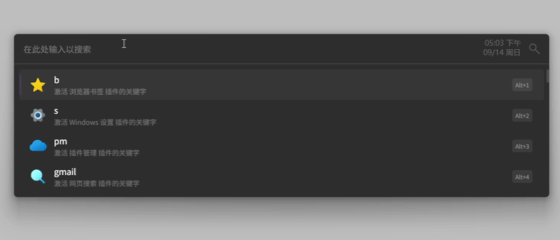

# Flow Launcher Plugin: Insert
Flow Launcher plugin for inserting text into string template.

## Install
- From Flow Launcher:
    - Directly from plugin market or query pm install Insert
- Manual:
    - Download or Build Release and install in Flow launcher manually

## Usage
- Trigger with "is" in default
    - is [template] [arg0] [arg1] ...
    - 
- You can pre-define some template in settings
    - 

- Futhermore, you can define shortcuts in FlowLaucher to make it even quicker to type
    - 

## Build
- clone this repo to local
- dotnet build -c Release

